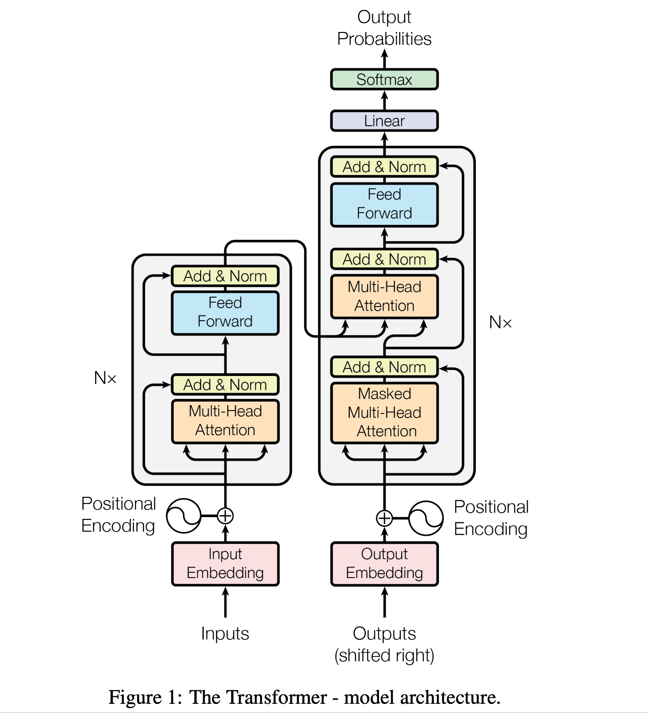
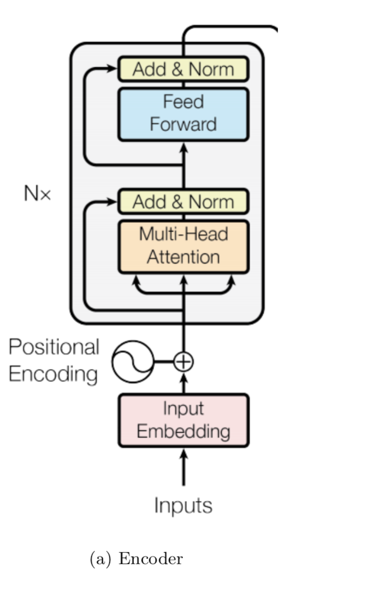
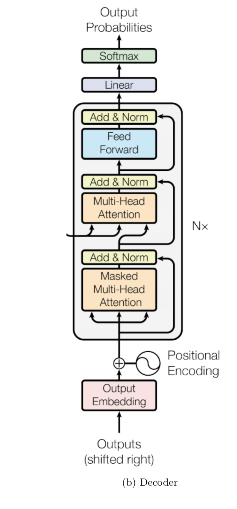
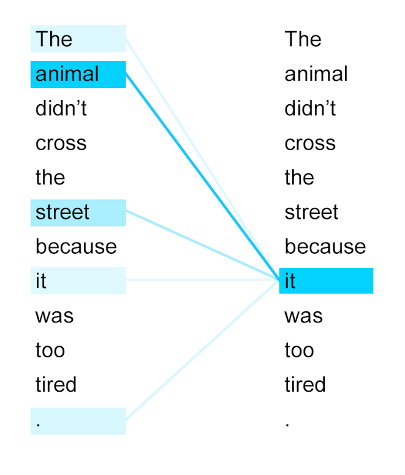
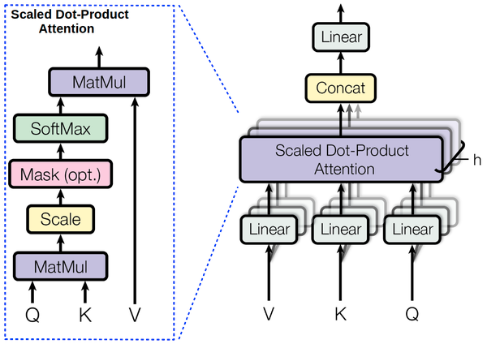
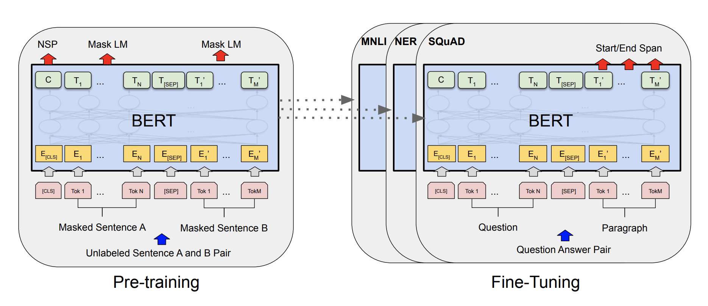
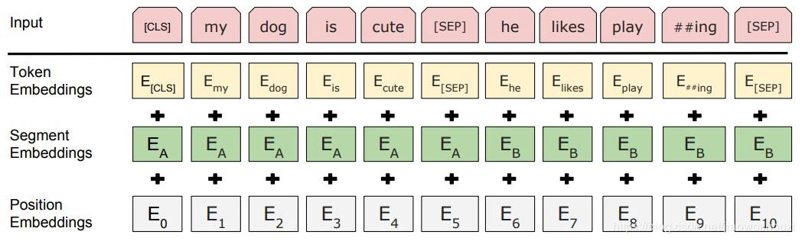
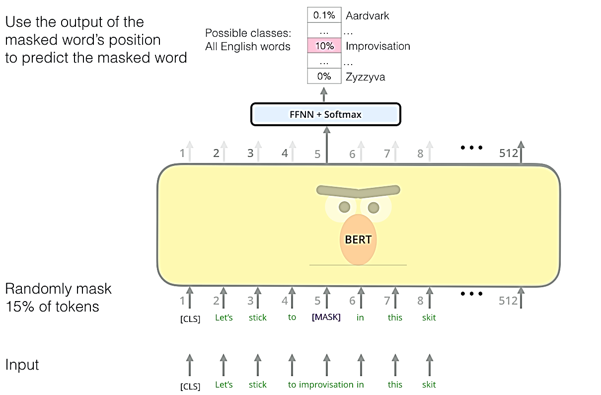
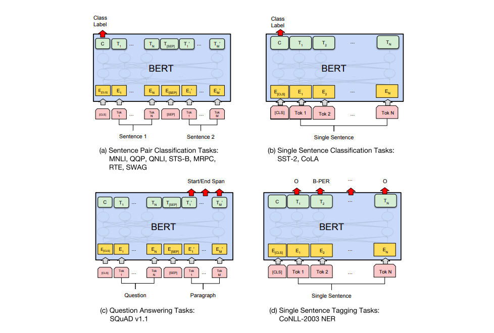

# Tuần 10: Tìm hiểu bert và áp dụng vào bài toán question answering tiếng việt
## Kiến trúc Transformer
* Theo như mô hình được đề xuất (Attention Is All You Need, A. Vaswani, 2017), ta thấy Transformer vẫn sử dụng mô hình theo thiết kế encoder-decoder truyền thống.
* Nửa bên trái là bộ encoder và nửa còn lại bên phải là decoder.

### Encoder:
* Bộ Encoder được tạo thành từ một bộ N=6 lớp giống hệt nhau (encoder layer) xếp chồng lên.
* Mỗi encoder layer gồm 2 sub-layer. Đầu tiên là bộ sử dụng kỹ thuật multi-head attention (gọi là self-attention) , thứ hai là một position-wise fully connected feed-forrward network.

### Decoder:
* Bộ Decoder cũng được tạo thành từ một N=6 lớp giống hệt nhau (decoder layer) xếp chồng lên.
* Mỗi lớp tương tự như encoder layer nhưng được bổ sung thêm một sub-layer là multi-head attention (gọi là encoder-decoder-attention) để thực hiện kỹ thuật attention giữa output của encoder layer với decoder layer hiện tại.

### Attention Mechanism
* Kỹ thuật Attention có thể mô tả như ánh xạ một query và một tập các cặp key-value thành một ouput.
* Output được tính toán đựa trên tổng trọng số của các giá trị trong values, với bộ trọng số ứng với mỗi value được tính toán bởi một hàm giữa query và keys.
 
### MultiHead Attention
* Với các queries, keys và values đã được project họ tiến hành áp dụng Scaled Dot-Product Attention song song với nhau thu được h output. Các output này được nối lại với nhau và tiến hành áp dụng một linear projection một lần cuối trả về kết quả cuối cùng. 
* $Multihead(Q,K,V) = concat(head_1, head_2,...,head_h).W^0$
        với  $head_i = Attention(QW_i^Q, KW_i^K, VW_i^V)$
    trong đó $Attention(Q,K,V) = softmax(\frac{QK^T}{\sqrt{d_k}})$

### Positional Embedding
* Transformer (với cách thức chạy song song) không thể thu được thông tin về vị trí các từ trong câu. Vì vậy, để giải quyết vấn đề này chúng ta cần phải bổ sung vào thông tin về vị trí tương đối hoặc tuyệt đối của các từ trong câu.
  * Ở đây, nhóm nghiên cứu có đưa ra lựa chọn là một hàm positional embedding cố định:
    * $PE(pos, 2i) = sin(\frac{pos}{10000^\frac{2i}{d_{model}}})$
    * $PE(pos, 2i + 1) = cos(\frac{pos}{10000^\frac{2i}{d_{model}}})$
  * Trong đó pos là vị trí của từ trong câu và  biểu diễn chiều thứ i của vector sau encode.
## BERT
### Mô hình BERT
* BERT (Bidirectional Encoder Representations from Transformers) được trình bày trong bài báo của nhóm nghiên cứu tại Google AI Language (J. Devlin et al, 2018) và đã đạt được những kết quả rất ấn tượng trên rất nhiều NLP task.
* Với ý tưởng tương tự so với một bài báo trước đó của OpenAI (A. Radford, 2018), BERT cũng là một mô hình được pre-train trên một tập dữ liệu cực lớn. Nhưng khác với người tiền nhiệm, thay vì cố gắng mô hình hóa dữ liệu theo hướng từ trái sang phải, BERT thực hiện một cải tiến việc huấn luyện theo hai chiều để thu được tri thức về ngữ cảnh và hướng chuyển tiếp của ngôn ngữ
* BERT dựa trên kiến trúc Transformer như đã trình bày ở trên nhưng không phải toàn bộ mà chỉ sử dụng bộ Encoder.
* Nhóm nghiên cứu đưa ra 2 phiên bản của BERT:
  * BERT-Base: L=12, H=768, A=12, Total Parameters=110M.
  * BERT-Large: L=24, H=1024, A=16, Total Parameters=340M.
  * Trong đó:
    * L: số layer encoder
    * H: (hidden size) số chiều biểu diễn trong mô hình.
    * A: số Head trong MultiHead Attention
* Để sử dụng BERT bao gồm 2 quá trình:
  * Pre-training: Trong quá trình Pre-training, mô hình được huấn luyện không giám sát với một lượng dữ liệu khổng lồ (không cần label).
  * Fine-tuning: mô hình BERT khởi tạo với các thông số đã được pre-train và được huấn luyện thêm với dữ liệu đã được label tùy theo từng downstream task.
  * 
### Pretrain
* Quá trình Pre-train cho mô hình BERT bao gồm 2 task dự đoán được thực hiện đồng thời là dự đoán từ bị che dấu (Masked Language Model) và dự đoán xem có phải là câu kế tiếp không.
* 
  * Để thực hiện được việc mô hình hóa ngôn ngữ theo 2 chiều, BERT đã sử dụng cơ chế self-attention trong kiến trúc Transformer Encoder và thực hiện việc chuyển 15\% các từ trong các câu input sẽ bị ngẫu nhiên thực hiện việc sau:
    * 80\% sẽ được thay thành [MASK]
    * 10\% sẽ được chuyển thành một từ ngẫu nhiên
    * 10\% sẽ được giữ nguyên.
    * Và mô hình sẽ được huấn luyện thực hiện việc dự đoán lại 15\% từ vừa bị xử lý.
    * 
  * Để huấn luyện cho mô hình hiểu được mối liên hệ giữa các câu với nhau, BERT đã sử dụng thêm một task dự đoán hai lớp để dự đoán 2 câu truyền vào có liên tiếp hay không. Dữ liệu input sẽ được chia như sau:
    * 50\% cặp câu sẽ được chọn trong corpus sao cho 2 câu là liên tiếp (câu thứ hai theo sau câu thứ nhất).
    * 50\% còn lại sẽ chọn ngẫu nhiên.
    *  Và mô hình sẽ được huấn luyện thực hiện việc dự đoán xem câu đứng sau có phải là kế tiếp của câu trước hay không.  
    *  
### Finetuning
*  Dữ liệu đầu cho quá trình Pre-train BERT: Một ký hiệu [CLS] (ký hiệu đặc biệt phục vụ việc phân loại) được chèn vào đầu câu thứ nhất, tiếp đó là câu thứ nhất, ký hiệu [SEP] (làm nhiệm vụ phân tách câu), câu thứ hai, ký hiệu [SEP].
*  
### Áp dụng bài toán question answering
* Bộ ngữ liệu: 
  * Là bộ ngữ liệu được tổ chức giống SQuAD cho đa ngôn ngữ, trong đó đối với tiếng việt (vi-vi)
    * Tập train: Gồm 2453 đoan hội thoại (3518 câu hỏi tổng cộng)
    * Tập test: Gồm 227 đoạn văn bản (325 câu hỏi tổng cộng)
  * Câu đầu thứ nhất ta sẽ đưa vào câu hỏi, câu thứ hai là đoạn văn bản. Từ data ta sẽ lấy ra vị trí bắt đầu và kết thúc câu trả lời đưa vào làm label cho bài toán (mô hình như trên pretrain của bài toán question-answering)
    * Kêt quả:
      * Với các thông số 
        ```
        learning_rate 3e-5
        num_train_epochs 2
        max_seq_length 384
        doc_stride 128
        ```
      * Results: {'exact': 27.984344422700588, 'f1': 44.033677415257436, 'total': 511, 'HasAns_exact': 27.984344422700588, 'HasAns_f1': 44.033677415257436, 'HasAns_total': 511, 'best_exact': 27.984344422700588, 'best_exact_thresh': 0.0, 'best_f1': 44.033677415257436, 'best_f1_thresh': 0.0}
    * So sánh với kết quả trên github của MLQA:
    
    
        | Model F1 Score | en | es | de | ar | hi| vi | zh | 
        |:--- |:---: |:---: | :---: |:---: | :---: | :---: | :---: | 
        BERT-Large    | **80.2**| - | - | - |- |- |- |
        Multilingual-BERT  | 77.7| 64.3| 57.9| 45.7| 43.8| 57.1| 57.5|
        XLM    |74.9| **68.0**| **62.2**|**54.8**| 48.8| 61.4| 61.1|
        Translate-test BERT-L    | -| 65.4 | 57.9 | 33.6 | 23.8 | 58.2 |44.2 |
        Translate-train M-BERT    | - | 53.9 | 62.0  | 51.8 | **55.0**| **62.0**| **61.4** |
        Translate-train XLM    | -| 65.2| 61.4| 54.0| 50.7| 59.3| 59.8 |
