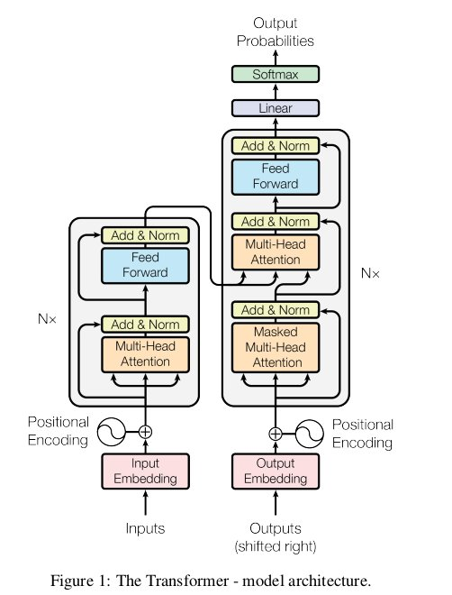

# Tìm hiểu BERT (Bidirectional Encoder Representation from Transformers)
04/04/2020

There are 2 steps to complete a task in NLP
- pre-training  
	The model is trained on unlabeled data over different pre-training tasks.
- fine-tuning  
	Bert model is first initialized with pre-trained parameters
	all parameters are fine-tuned using label data from downstream tasks.

BERT model architecture is a multi-layer bidirectial Transformer encoder based on the original implementation [Vswani el all. 2017]()

## Architecture Transformer: (Ashish Wasani)
Before: RNN or CNN: long-shore term memory attention => sequential computation remains  
Transformer: using self-attention  
input (x1, ..., xn) -> (z1, ..., zn) => (y1, ..., ym) at a time and consuming the previously generated symbols as additional input when generating the text.  

The Transformer follow all architecture using
- stacked self-attention
- point-wise

The Transformer use multi-head attention 

Quy uoc:  
L: number of layers  
H: hidden size  
A: number of self-attention heads  
"sequence": input token sequence to BERT (1 or more sentences)  

### Pre-training BERT
using 2 upsupervise tasks:
- task 1: Masked LM (MLM)  
	Mask some percentage (15%) of the input tokens at random([MASK] or ...) and predict those masked tokends.
- task 2: Next Sentence Prediction (NSP)
	A-B (50% B is actually Next and 50%B is NotNext)
	
768 in Bert Base and 1024 in bert large

Glove and Word2Vector: meaning and relation ship between 2 words
ELMo: Take into account context 